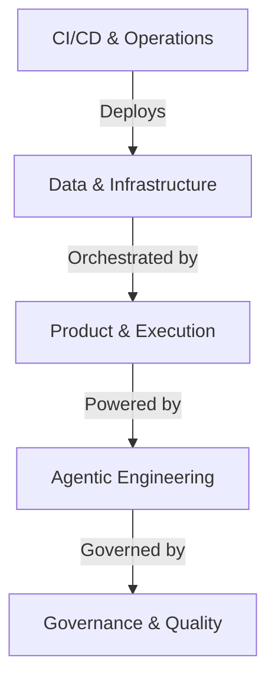
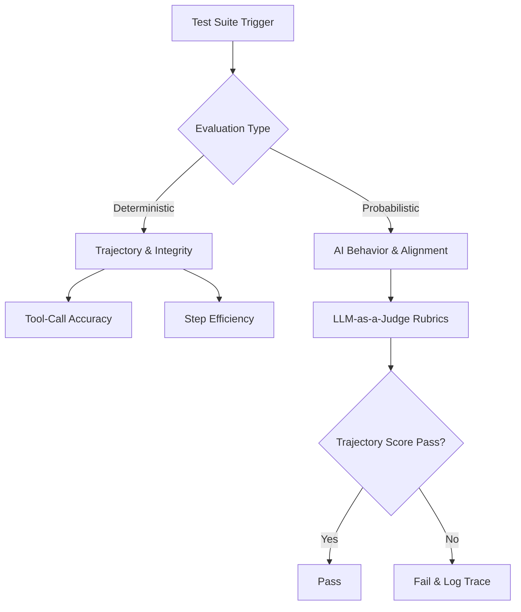

# Antigravity Base Agentic Environment


## System Architecture

*Technical View:*


## Agentic Handover Flow

*Technical View:*


## Dependency Graph (AST)
This project uses [repowise](https://repowise.dev) to build a **Tree-sitter AST dependency graph** across all project code. The graph captures imports, function calls, class inheritance, and co-change patterns — then ranks nodes by PageRank and betweenness centrality.

```bash
# First-time setup (no API key needed)
repowise init --yes --mode fast --no-editor-setup --no-claude-md --no-agents

# View the interactive dependency graph dashboard
repowise serve
# → Open http://localhost:3000

# Incremental update after code changes
repowise update
```

**Current index:** 564 nodes · 498 edges · Health score: 9.7/10 (Healthy)

## Overview
This repository serves as a dual-capability environment:
1. **Gemini API RAG Engine (`gemini_rag.py`)**: A production-grade document intelligence pipeline providing full-context multi-document reasoning via the Google Gemini File API, with local Excel conversion and SQLite-persisted vector RAG.
2. **Base Agentic Governance Environment**: Built on the Antigravity framework with a strict **Split-Plane Architecture** separating the human-defined control plane (`.agents/`) from the system-managed data and state plane (`data/`).

## Gemini RAG Engine (`gemini_rag.py`)
- **Dual Mode**:
  - *Full-Context RAG (`upload_docs` / `query`)*: Direct ingestion via Gemini File API with multi-document cross-referencing and source attribution.
  - *SQLite Vector RAG (`build_index` / `rag_query`)*: Local chunking, embedding via `gemini-embedding-2`, and persistent cosine retrieval in SQLite (`rag_index.db`).
- **File Preflight & Ingestion**: Local zero-cost inspection and automatic structured tabular extraction for `.xlsx`, `.csv`, `.pdf`, `.md`, and `.txt`.
- **Quota Resilience**: Adaptive exponential backoff, jitter, and automatic RPM pacing.

## Installation & Setup (Standalone Execution)

```bash
# 1. Clone the repository
git clone https://github.com/hitanshuac/gemini-api-rag.git
cd gemini-api-rag

# 2. Configure Environment
# Copy or create your .env file:
# GEMINI_API_KEY=your_gemini_api_key_here

# 3. (Optional) Create and activate a virtual environment
python -m venv .venv
# On Windows: .venv\Scripts\activate
# On Linux/Mac: source .venv/bin/activate

# 4. Install dependencies
pip install -r requirements.txt
pip install google-genai pypdf openpyxl python-dotenv
```


## Current Capabilities

### Governance Rules (`.agents/rules/`)
* **12-Factor Governance:** Enforces all 12 factors of stateless processes and BYOK configuration.
* **Defensive Programming:** Pydantic schema-first data contracts and fail-fast operations to prevent silent data loss.
* **Rule Conflict Resolution:** 5-tier safety hierarchy ensuring Data Integrity (Tier 0) always overrides Style/Compliance (Tiers 3-4).
* **Testing Standards:** Mandates the Test Pyramid, state-aware integration tests, and fixture verification gates.
* **Linting & Code Quality:** Enforces exponential-speed static analysis via Ruff, and explicit enterprise-grade code structures.
* **No Unauthorized Deletions:** Strictly forbids destructive actions without manual approval, with semantic merge exemptions.
* **Error Observability:** Mandatory error interception, pre-write verification gates, and AST compression via jCodeMunch.
* **Context Compaction & Router Alignment:** Strict token conservation and payload mutation for Agentic AI.
* **Data Validation:** Idempotent DLQ routing and robust schema enforcement for local JSON files.
* **SQL Standards:** Write-Ahead Logging and `INSERT OR REPLACE` idempotency via DuckDB.
* **Anti-AI-Slop Design:** Constrains the agent to output professional-grade, high-fidelity design standards, avoiding generic UI tropes.
* **SRE Standard Operating Procedure:** Rhythmic Inner and Outer loops enforcing deterministic verification after every iteration.
* **Hugging Face & SAST Standards:** Zero-cost offsite WebUI routing deployment and OPSEC-sanitized remote evaluation compliance.
* **Environment Awareness:** Mandatory pre-flight dependency scans to prevent language hallucination in non-Python workspaces.
* **Anti-Over-Engineering:** Enforces the 7-step Ponytail decision ladder (YAGNI, Context, Stdlib, Native, Dependencies, One-Liner, Minimum Viable Code).
* **Language-Agnostic Engine:** Exposes governance rules as tools via a strict `stdio` Model Context Protocol (MCP) server for cross-ecosystem agent support.
* **Skill Bifurcation:** Intelligent skill pack filtering that dynamically ships ecosystem-specific skills (e.g., JavaScript Web vs Python API) based on project structure.
* **Modular Competition Rules:** Hackathon-specific logistics (e.g., Hack2Skill) are modularized and optionally toggleable.


### Product & Systems Design (`.agents/product/`)
* **Product Templates:** Pre-defined frameworks for PRDs, Technical Architecture (TAD), Security Specs, Frontend Specs, and Feature Ticket Lists to guarantee deterministic AI output.
* **Architecture Decision Records (ADRs):** Immutable log of architectural choices (`.agents/architecture/adrs/`).

## Intelligence Domains: Skills & Workflows

This environment organizes its **30 Skills** and **30 Workflows** into interdependent domains. Skills provide the agent with specialized capabilities and patterns, while Workflows orchestrate those skills into multi-step execution plans.



### 1. Governance & Quality Control (The Foundation)
Ensures zero-defect compliance, data integrity, and deterministic execution.
*   **Skills:**
    *   `code-quality`: Enterprise Code Quality Standards (SAST, Ruff).
    *   `defensive-programming`: Schema validation and fast-failing.
    *   `design-standards`: Anti-over-engineering and high-fidelity UI design.
    *   `error-pattern-library`: Living reference of common failure patterns with proven fixes.
    *   `sast-compliance`: Strict engineering rules for zero-defect compliance.
    *   `test-engineering`: Pytest, fixtures, and state-aware integration tests.
*   **Workflows:** `error-observability` (error logging), `lint` (static analysis), `security-sast` (Semgrep), `test-automation` (test suite execution).

### 2. Agentic Engineering & Harnesses (The Inner Loop)
Patterns that improve how the LLM communicates with itself, reflects, and self-corrects.
*   **Skills:**
    *   `agent-evals`: Builds evaluation harnesses using trajectory scoring.
    *   `context-compactor`: Manages LLM context window via sliding windows.
    *   `hitl-interrupts`: Compiles LangGraph workflows with Human-in-the-Loop checkpoints.
    *   `langgraph-orchestrator`: Scaffolds production-grade LangGraph state machines.
    *   `llm-council`: Runs decisions through a council of 5 AI peer-reviewers.
    *   `loop-detector`: Detects runaway retry cycles and forces structured escalation.
    *   `mcp-server-architect`: Scaffolds custom Model Context Protocol (MCP) servers.
    *   `multi-agent-crew`: Builds multi-agent teams with strict role contracts.
    *   `prompt-registry-sync`: Externalizes LLM prompts to versionable markdown.
    *   `quota-optimizer`: Prevents excessive API quota drain.
    *   `self-reflection`: 5-point Reflexion protocol for structured self-critique.
    *   `session-memory`: Persists decisions across long sessions (SESSION_LOG.md).
    *   `structured-output`: Enforces Pydantic-based JSON schemas for LLM calls.
    *   `telemetry-tracing`: Implements LangSmith/OpenTelemetry tracing.

### 3. Product & Execution (The Outer Loop)
Rapid prototyping, spec-driven development, and time-pressured hackathon velocity.
*   **Skills:**
    *   `competitive-recon`: Rapid landscape scan, gap analysis, and differentiation framing.
    *   `developing-with-streamlit`: [REQUIRED] Master skill for all Streamlit tasks.
    *   `meta-agent-formats`: Output templates for Rules, Proposals, and Reviews.
    *   `rapid-prototyping`: 5-minute scaffolds for Streamlit, Gradio, and FastAPI+HTMX.
*   **Workflows:** 
    *   `code-generation-preflight`: Mandatory pre-coding checklist.
    *   `demo-first`: Builds demo script BEFORE implementation.
    *   `generate-diagrams`: Dual-engine pipeline — repowise AST dependency graphs + D2 conceptual diagrams.
    *   `generate-product-docs`: PRD generation.
    *   `hackathon-sprint`: Master 5-phase time-boxed sprint orchestrator.
    *   `spec-first`: Spec-Driven Development (Produces SPEC.md, ARCHITECTURE.md, TASKS.md).

### 4. Data Engineering & Infrastructure (The Data Plane)
Scalable pipelines, RAG systems, and memory stores.
*   **Skills:**
    *   `duckdb-optimizer`: Configures DuckDB for maximum reliability and speed.
    *   `episodic-memory-manager`: Integrates Episodic Memory (Mem0/Zep).
    *   `pipeline-architect`: Designs minimalist, fault-tolerant ETL pipelines.
    *   `rag-pipeline`: Production-grade RAG with structure-aware chunking.
    *   `universal-ingestion`: Implements MarkItDown to flatten unstructured files.
*   **Workflows:** `build-api-router`, `build-etl`, `daily-ingestion`, `error-recovery`.

### 5. CI/CD & Operations (The Deployment Plane)
Deployment, Git orchestration, and automated maintenance.
*   **Skills:**
    *   `deployment-ops`: Hugging Face Spaces deployments and Upstream syncing.
*   **Workflows:** 
    *   **Deployments:** `deploy-hf-production`, `deploy-streamlit-production`.
    *   **Version Control:** `git-discovery-preflight`, `merge-conflict-resolution`, `secure-checkpoint`, `setup-git`, `sync-upstream`.
    *   **Refactoring:** `agentic-refactor`, `compliant-refactor`, `dead-code-cleanup`.
    *   **Orchestration:** `bootstrap`, `master-sync`, `publish-showcase`, `semantic-release`, `setup-secrets`, `sync-ci-errors`, `update-docs`.

## Directory Structure
```text
.
├── .agents/            # The Control Plane: Rules, Skills, and Workflows (Human Edited)
├── .config/            # Environment configurations and MCP integrations
├── src/antigravity/    # Application source code and Python starter kit (FastAPI, Routers, Capabilities)
├── data/               # The Data Plane: DuckDB metrics, Quarantine DLQs, and Parquet files (System Managed)
└── hf-webui/           # Hugging Face Spaces frontend deployment configurations
```


## How to Adopt This Environment (Injection Method)
To test if this environment works as intended in your own projects, you do not need to rewrite your entire codebase. Instead, you inject the "Agentic Brain".

### For Brand New Projects (Fresh Start)
Create a new project directly from this template using the GitHub CLI:
```bash
gh repo create my-project --template hitanshuac/antigravity-agentic-governance-template
```
Once cloned, open the project in your IDE and execute `/.agents/workflows/bootstrap.md` to finish scaffolding.

### For Existing Projects (Injection)
If your project already exists and you just want to inject governance capabilities, run this in your terminal:
```bash
git clone https://github.com/hitanshuac/antigravity-agentic-governance-template .gov-temp
cp -r .gov-temp/.agents . && rm -rf .gov-temp
```
Then tell your IDE Copilot: `Execute /.agents/workflows/bootstrap.md`

### Upgrading an Existing Installation
If your project already has an older `.agents/` folder, tell the IDE:
> *"/ask run @[.agents/workflows/bootstrap.md]"*

The workflow will automatically clone the latest upstream template, merge in the new skills and rules, and present you with a list of old/deprecated files to delete. **It will explicitly ask for your manual confirmation before deleting any deprecated files.**

---

## Visual Reference Appendix

### The Agentic Handover Workflow

*Technical View:*


### Dual-Prong Testing Architecture (2026 Evals Standard)



[View Agentic Environment Documentation](docs/antigravity/AGENT_DOCS.md)
